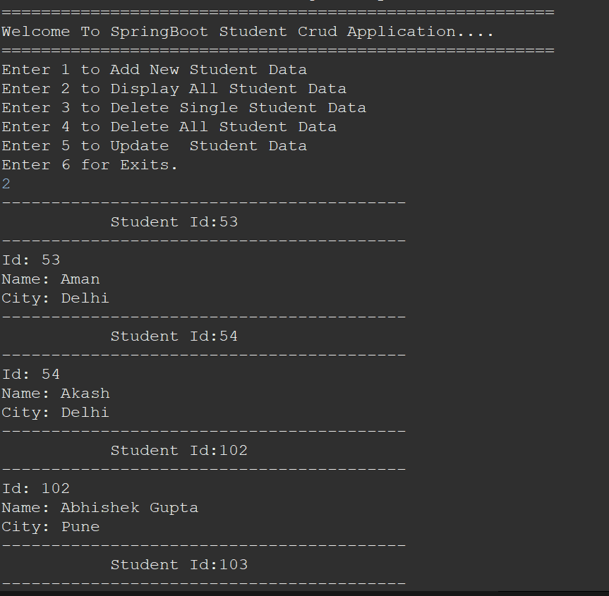
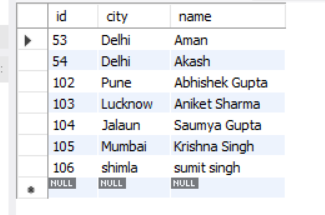

# SpringBootCrudApplication
in This project we Are using Springboot and by using JPA we create a Student Crud Application with connect MYSQL Database not using this framework i have no create any query no create any method Springboot have a  all of these method 

# Student Crud Application

Description of my project.

## Features

- Add New Student
- Display Student By Id
- Display All Student
- Delete One Student
- Delete All Student
- Update Student 

## Usage

How to use the project.
-First You clone my project by gitBash/Any other 
-Going the Application.properties 
-change your database name in url 
-create a table on your database Student table
-if You want any other table name so you go to the pojo class 
- use the annotation @Table(name="here your choice table name")in the top of class because hibernate just create a class name or table name same.
-And you are able to run your project.

## Screenshots

## Contributions

Guidelines for contributing to the project.

## License

Information about the project's license.

